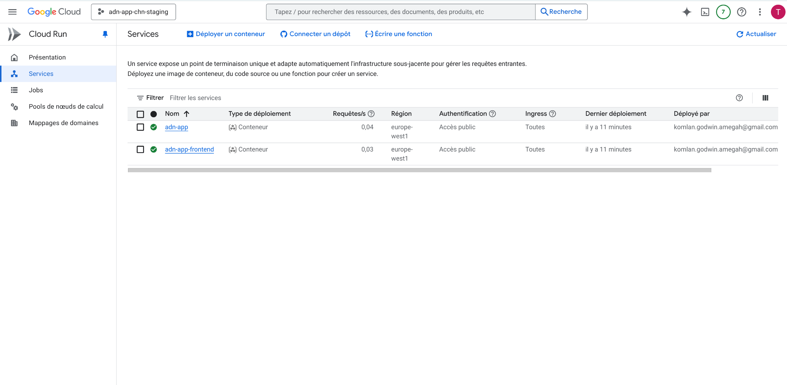
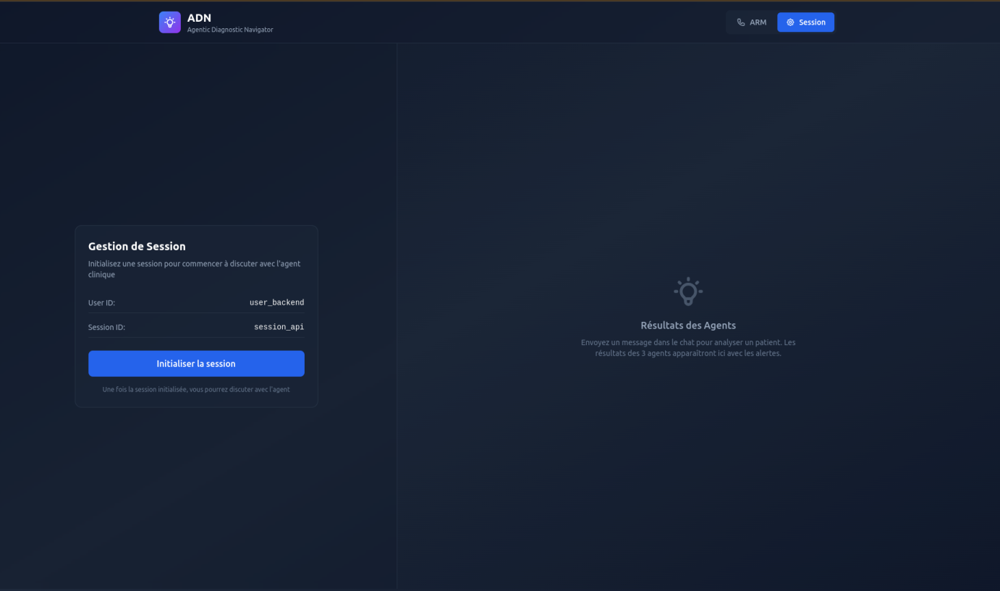

# ADN - AI Diagnostic Navigator

> 🏥 **Medical decision support system for emergency situations based on multi-agent artificial intelligence**

[](https://cloud.google.com)
[](https://fastapi.tiangolo.com)
[](https://www.python.org)
[](https://github.com/google/adk-python)


## Architecture Overview


## Agent tools

### Collecteur Agent
**Retrieving patient medical records**: Access and fetch patient data from the MIMIC-III clinical database.

### Synthetiseur Agent  
**Summarizing patient data**: Generate concise summaries of patient medical histories and current conditions.

### Expert Agent
**Providing medical recommendations**: Analyze patient data and offer diagnostic and treatment suggestions based on established medical guidelines.

## Getting Started

### Prerequisites
- Python 3.10+
- GCloud CLI and GCP Account
- Terraform installed
- Agent Development Kit Required Python packages (see pyproject.toml)
- Node.js and npm installed

### Installation

1. **Clone the repository and Install dependencies**:
```bash
git clone https://github.com/goamegah/adn
cd adn
```

2. **Set up Google Cloud SDK and authenticate**:
```bash
gcloud auth login
gcloud config set project YOUR_PROJECT_ID
```
Replace `YOUR_PROJECT_ID` with your actual GCP project ID.

3. **Install Python dependencies for the ADN agent**:
```bash
uv sync
```

3. **Install Node.js dependencies for the Next.js frontend**:
```bash
cd frontend
npm install
```

### Resources Provisioning and Deployment

Here the simplified view of the deployment process:


We will have 3 projects:
- staging : `adn-app-chn-staging`: test environment to validate new features before production deployment.
- production : `adn-app-chn-prod`: production environment hosting the ADN agent and Frontend for end users.
- cicd : `adn-app-chn-cicd`: responsible for executing CI/CD pipelines via Cloud Build for staging and production environments.

#### Provision Google Cloud resources with Terraform:

```bash
cd deployment/terraform
terraform init --var-file=vars/env.tfvars
terraform plan --var-file=vars/env.tfvars
terraform apply --var-file=vars/env.tfvars
```

#### Upload MIMIC Data
Upload the MIMIC data you can obtain via Kaggle: https://www.kaggle.com/datasets/atamazian/mimic-iii-clinical-dataset-demo, into the Cloud Storage bucket (`adn-app-chn-staging-mimic-data`) created during resource provisioning in the staging project.
Once done, you can:

- Trigger the `import-mimic.yaml` pipeline from `Cloud Build` to import the data into Cloud SQL (for the staging project). This pipeline uses the `import_mimic.py` script located in the `/scripts/` directory.

- Trigger the `staging.yml` pipeline from Cloud Build to deploy the agent and frontend in `Cloud Run` of the staging project.


You can then access the Next.js web interface of the ADN agent via the URL provided by Cloud Run once the deployment is complete.



To do this:
- Give public access to the ADN agent backend from the Cloud Run interface of the staging project.


- Do the same for the frontend.

The link to the frontend will take you to the following page:



You can now interact with the ADN agent via this Next.js web interface.


You will find an additional list of ids in the mimic3_ids.csv file with which you can test the ADN agent.

### Quick Start

#### Clinical Agent
```bash
cd app
adk web
```

## Usage Examples

### ADN Agent

