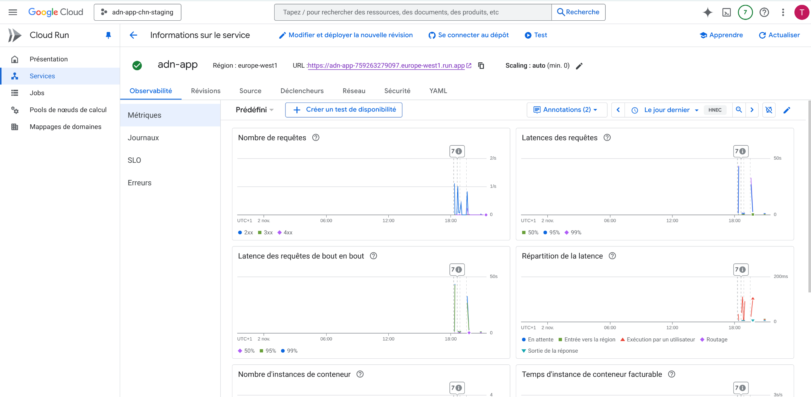
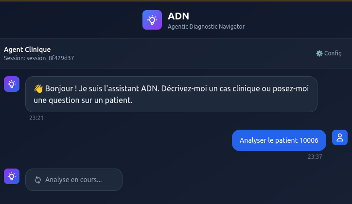

# ADN - AI Diagnostic Navigator

> 🏥 **Système d'aide à la décision médicale basé sur l'Intelligence Artificielle multi-agents**

[](https://cloud.google.com)
[](https://fastapi.tiangolo.com)
[](https://www.python.org)
[](https://github.com/google/adk-python)

---

# Quick Start

Notre solution est déployée sur Google Cloud Platform et utilise plusieurs services GCP tels que Cloud Run, Cloud SQL, Cloud Storage, et Cloud Build pour l'intégration continue et le déploiement continu (CI/CD). Nous disposons de deux environnements distincts : staging et production, chacun hébergé dans des projets GCP séparés pour garantir l'isolation et la sécurité des données.

Nous disposerons donc de 3 projets :

- staging : `adn-app-chn-staging`: environnement de test pour valider les nouvelles fonctionnalités avant leur mise en production.
- production : `adn-app-chn-prod`: environnement de production hébergeant l'agent ADN pour les utilisateurs finaux.
- cicd : `adn-app-chn-cicd`: chargé d'exécuter les pipelines CI/CD via Cloud Build pour les environnements staging et production.


### Provisioner les ressources Google Cloud nécessaires avec Terraform :

```bash
cd deployment/terraform
terraform init --var-file=vars/env.tfvars
terraform plan --var-file=vars/env.tfvars
terraform apply --var-file=vars/env.tfvars
```

### Uploader les données 

Téléverser les données MIMIC que vous pouvez obtenir via Kaggle: https://www.kaggle.com/datasets/atamazian/mimic-iii-clinical-dataset-demo, dans le bucket Cloud Storage (`adn-app-chn-staging-mimic-data`) créé lors du provisionnement des ressources dans le projet staging.

une fois effectuer vous pouvez déclencher depuis `Cloud Build` le pipeline import-mimic.yaml pour importer les données dans Cloud SQL (pour le projet staging). ce pipeline utilise le script `import_mimic.py` situé dans le répertoire `/scripts/`.


Maintenant vous pouvez déclencher depuis Cloud build le pipeline ```staging.yml``` pour déployer l'agent dans `Cloud Run` du projet staging.


Vous pourrez donc consulter l'interface web Next.js de l'agent ADN via l'URL fournie par Cloud Run une fois le déploiement terminé. 

Pour cela:

- Donner un accès public au backend de l'agent ADN depuis l'interface Cloud Run du projet staging.


- Faites de même pour le frontend.




Le lien vers le frontend vous amènera à la page suivante:


Vous pouvez maintenant interagir avec l'agent ADN via cette interface web Next.js




Vous trouverez une liste complémentaire d'id dans le fichier mimic3_ids.csv avec lequel vous pouvez tester l'agent ADN.


