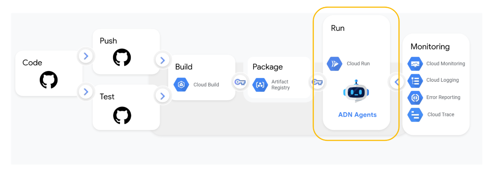

# ADN - AI Diagnostic Navigator

> 🏥 **Système d'aide à la décision médicale basé sur l'Intelligence Artificielle multi-agents**

[](https://cloud.google.com)
[](https://fastapi.tiangolo.com)
[](https://www.python.org)
[](https://github.com/google/adk-python)

---

# Quick Start

### Provisioner les ressources Google Cloud nécessaires avec Terraform :

```bash
cd deployment/terraform
terraform init --var-file=vars/env.tfvars
terraform plan --var-file=vars/env.tfvars
terraform apply --var-file=vars/env.tfvars
```

### Uploader les données 

Téléverser les données MIMIC que vous pouvez obtenir via Kaggle: https://www.kaggle.com/datasets/atamazian/mimic-iii-clinical-dataset-demo, dans le bucket Cloud Storage créé lors du provisionnement des ressources dans le projet staging.

une fois effectuer vous pouvez déclencher depuis `Cloud Build` le pipeline import-mimic.yaml pour importer les données dans Cloud SQL (pour le projet staging). ce pipeline utilise le script `import_mimic.py` situé dans le répertoire `/scripts/`


Maintenant vous pouvez déclencher depuis Cloud build le pipeline staging.yml pour déployer l'agent dans `Cloud Run` du projet staging.





Vous pourrez donc consulter l'interface web de l'agent ADN via l'URL fournie par Cloud Run une fois le déploiement terminé.


### Visualiser l'interface Next.js de l'agent ADN


#### En local 

- Créer un environnement virtuel, installer les dépendances puis activer l'environnement virtuel.

```
uv sync
```

- Lancer le backend FastAPI localement

```bash
cd app 
python server.py
```

- Récupérer l'url du backend Modifier l'url du backend
```
cd frontend
npm install
npm run dev
```


