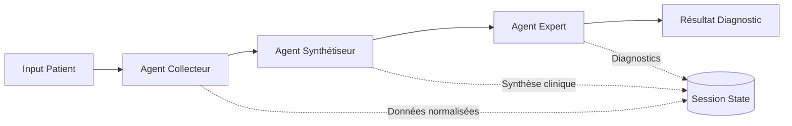

# ADN - AI Diagnostic Navigator

> 🏥 **Système d'aide à la décision médicale basé sur l'Intelligence Artificielle multi-agents**

[](https://cloud.google.com)
[](https://fastapi.tiangolo.com)
[](https://www.python.org)
[](https://github.com/google/adk-python)

---

## 📋 Table des Matières

- [Vue d'ensemble](#-vue-densemble)
- [Architecture](#-architecture)
- [Fonctionnalités](#-fonctionnalités)
- [Prérequis](#-prérequis)
- [Installation](#-installation)
- [Utilisation](#-utilisation)
- [Architecture des Agents](#-architecture-des-agents)
- [API Endpoints](#-api-endpoints)
- [Données](#-données)
- [Déploiement](#-déploiement)
- [Monitoring](#-monitoring)
- [Développement](#-développement)
- [Tests](#-tests)
- [Contributing](#-contributing)

---

## 🎯 Vue d'ensemble

**ADN (AI Diagnostic Navigator)** est un système multi-agents intelligent conçu pour assister les professionnels de santé dans le processus de diagnostic médical. Le système utilise l'architecture **Google Agent Development Kit (ADK)** et des modèles **Gemini 2.5** pour orchestrer plusieurs agents spécialisés qui collaborent pour :

- 📊 **Collecter et normaliser** les données patients depuis diverses sources (MIMIC-III, texte médical brut)
- 🧠 **Synthétiser et critiquer** les informations cliniques avec une approche Jekyll/Hyde
- 🔬 **Générer des diagnostics différentiels** avec scoring de probabilité
- 🚨 **Détecter des alertes critiques** nécessitant une action immédiate
- 📝 **Produire des recommandations** d'actions thérapeutiques

### Cas d'usage

- **Urgentistes** : Aide à la régulation médicale et triage des appels
- **Médecins généralistes** : Support au diagnostic différentiel
- **Équipes de recherche** : Analyse de cohortes de patients
- **Formation médicale** : Outil pédagogique pour l'apprentissage du raisonnement clinique

---

## 🏗️ Architecture

### Architecture Système

```
┌─────────────────────────────────────────────────────────────┐
│                    Frontend (Next.js)                       │
│              Interface utilisateur interactive               │
└──────────────────────┬──────────────────────────────────────┘
                       │ HTTP/REST API
┌──────────────────────┴──────────────────────────────────────┐
│              Backend FastAPI + Google ADK                    │
│  ┌────────────────────────────────────────────────────────┐ │
│  │           Orchestrateur ADN (Multi-Agent)               │ │
│  │  ┌─────────────┐  ┌──────────────┐  ┌──────────────┐  │ │
│  │  │   Agent 1   │→│   Agent 2    │→│   Agent 3    │  │ │
│  │  │ Collecteur  │  │ Synthétiseur │  │   Expert     │  │ │
│  │  │  de Données │  │  Jekyll/Hyde │  │  Diagnostic  │  │ │
│  │  └─────────────┘  └──────────────┘  └──────────────┘  │ │
│  └────────────────────────────────────────────────────────┘ │
└──────────────────────┬──────────────────────────────────────┘
                       │
        ┌──────────────┴──────────────┐
        │                             │
┌───────▼────────┐          ┌────────▼─────────┐
│  MIMIC-III DB  │          │  Vertex AI API   │
│  (PostgreSQL)  │          │  (Gemini 2.5)    │
└────────────────┘          └──────────────────┘
```

### Architecture Multi-Agents

Le système repose sur **3 agents spécialisés** orchestrés séquentiellement :



#### 🤖 Agent 1 : Collecteur
**Responsabilité** : Extraction et normalisation des données patients
- Sources : Base MIMIC-III, texte médical libre
- Normalisation des signes vitaux, antécédents, traitements
- Format de sortie standardisé pour les agents suivants

#### 🧪 Agent 2 : Synthétiseur (Jekyll/Hyde)
**Responsabilité** : Analyse critique en double perspective
- **Jekyll** (Synthétiseur) : Résumé optimiste des données
- **Hyde** (Critique) : Identification des lacunes et incohérences
- Détection d'alertes critiques (hémorragie, sepsis, AVC...)
- Évaluation de la sévérité

#### 🎓 Agent 3 : Expert
**Responsabilité** : Génération de diagnostics différentiels
- Scoring de probabilité par pathologie
- Preuves cliniques à l'appui (findings + sources)
- Recommandations d'examens complémentaires
- Plan d'action thérapeutique priorisé

---

## ✨ Fonctionnalités

### Fonctionnalités Principales

- ✅ **Analyse Multi-Source** : MIMIC-III + texte médical libre
- ✅ **Diagnostics Différentiels** : Top N pathologies avec scores
- ✅ **Alertes Critiques** : Détection automatique des urgences
- ✅ **RAG (Retrieval-Augmented Generation)** : Base documentaire SFMU
- ✅ **Session Management** : Historique conversationnel
- ✅ **API REST Complète** : Endpoints standardisés
- ✅ **Streaming SSE** : Réponses en temps réel
- ✅ **Observabilité** : Traces OpenTelemetry + Cloud Logging

### Endpoints Personnalisés

| Endpoint | Description |
|----------|-------------|
| `POST /start_session` | Crée une session utilisateur |
| `POST /send_message` | Envoie un message à l'agent |
| `POST /get_state` | Récupère l'état de la session |
| `POST /get_agent_outputs` | Extrait les outputs des agents |
| `POST /api/analyze` | Analyse complète d'un patient |
| `GET /health` | Health check du service |

---

## 📦 Prérequis

### Outils Requis

- **Python 3.10+** : Langage principal
- **uv** : Gestionnaire de paquets Python - [Installation](https://docs.astral.sh/uv/getting-started/installation/)
- **Google Cloud SDK** : Pour les services GCP - [Installation](https://cloud.google.com/sdk/docs/install)
- **Terraform** : Infrastructure as Code - [Installation](https://developer.hashicorp.com/terraform/downloads)
- **make** : Automatisation des tâches (préinstallé sur Linux/macOS)
- **Docker** (optionnel) : Pour la conteneurisation

### Services Google Cloud

- **Vertex AI** : API Gemini 2.5
- **Cloud Run** : Hébergement serverless
- **Cloud Storage** : Stockage des artefacts
- **Cloud Logging & Trace** : Observabilité
- **PostgreSQL** (AlloyDB/Cloud SQL) : Base de données MIMIC-III

### Configuration Initiale

1. **Authentification GCP** :
```bash
gcloud auth application-default login
gcloud config set project YOUR_PROJECT_ID
```

2. **Variables d'environnement** :
```bash
export GCP_PROJECT_ID="your-project-id"
export GOOGLE_CLOUD_PROJECT="your-project-id"
export GOOGLE_CLOUD_LOCATION="europe-west1"
export GOOGLE_GENAI_USE_VERTEXAI="True"
```

---

## 🚀 Installation

### Installation Rapide

```bash
# 1. Cloner le repository
git clone https://github.com/goamegah/adn.git
cd adn

# 2. Installer les dépendances
make install

# 3. Lancer l'environnement de développement
make playground
```

### Installation Détaillée

#### 1. Environnement Virtuel

```bash
# Installation avec uv (recommandé)
curl -LsSf https://astral.sh/uv/install.sh | sh
uv sync --dev

# OU avec venv classique
python -m venv .venv
source .venv/bin/activate
pip install -r requirements.txt
```

#### 2. Configuration de la Base de Données

**Option A : MIMIC-III en Local**
```bash
# Installer PostgreSQL
sudo apt install postgresql postgresql-contrib

# Créer la base et importer les données
createdb mimic3
psql mimic3 < data/mimic/schema.sql
python scripts/import_mimic.py
```

**Option B : Cloud SQL / AlloyDB**
```bash
# Configurer via Terraform
cd deployment/terraform
terraform init
terraform apply -var-file=vars/dev.tfvars
```

#### 3. Configuration des Agents

Les agents sont définis dans `app/agents/`. Chaque agent a son propre répertoire :

```
app/agents/
├── collector/agent.py      # Agent 1
├── synthesizer/agent.py    # Agent 2
├── expert/agent.py         # Agent 3
└── orchestrator/agent.py   # Orchestrateur principal
```

---

## 💻 Utilisation

### Développement Local

#### 1. Interface Web (Playground)

```bash
make playground
# Ouvre http://localhost:8501
```

L'interface permet :
- Chat interactif avec l'agent
- Inspection de l'état de session
- Visualisation des traces d'exécution
- Hot-reload automatique du code

#### 2. Serveur Backend Seul

```bash
make local-backend
# API disponible sur http://localhost:8000
```

Documentation interactive : http://localhost:8000/docs

#### 3. Tests Programmatiques

Créez un script `test_agent.py` :

```python
import asyncio
from google.adk.runners import Runner
from google.adk.sessions import InMemorySessionService
from google.genai import types as genai_types
from app.agents.orchestrator.agent import OrchestrateurADN

async def test_agent():
    # Configuration
    session_service = InMemorySessionService()
    await session_service.create_session(
        app_name="adn", 
        user_id="test_user", 
        session_id="test_session"
    )
    
    # Orchestrateur
    orchestrateur = OrchestrateurADN(project_id="your-project-id")
    
    # Requête
    query = "Patient de 65 ans, douleur thoracique depuis 2h, dyspnée"
    
    # Analyse
    resultat = orchestrateur.analyser_texte_medical(query)
    
    # Affichage
    print("🩺 Diagnostics différentiels:")
    for dx in resultat['agent3_expert']['differential_diagnoses'][:3]:
        print(f"  - {dx['diagnosis']} ({dx['probability']})")

# Exécution
asyncio.run(test_agent())
```

Lancez le test :
```bash
uv run python test_agent.py
```

### Utilisation de l'API REST

#### Exemple 1 : Analyse d'un Patient MIMIC-III

```bash
curl -X POST http://localhost:8000/api/analyze \
  -H "Content-Type: application/json" \
  -d '{
    "patient_id": "10006",
    "query": "",
    "metadata": {}
  }'
```

#### Exemple 2 : Analyse de Texte Médical

```bash
curl -X POST http://localhost:8000/api/analyze \
  -H "Content-Type: application/json" \
  -d '{
    "query": "Femme de 45 ans, céphalées intenses depuis 6h, photophobie, vomissements. ATCD: migraines. FC 88, TA 135/85, Temp 37.2°C",
    "metadata": {}
  }'
```

#### Exemple 3 : Session Interactive

```python
import requests

# 1. Créer une session
response = requests.post("http://localhost:8000/start_session", json={
    "user_id": "doctor_123",
    "initial_state": {"preferred_language": "French"}
})
session = response.json()

# 2. Envoyer un message
response = requests.post("http://localhost:8000/send_message", json={
    "user_id": "doctor_123",
    "session_id": session['session_id'],
    "query": "Analyse le patient 10006 de MIMIC-III"
})
result = response.json()
print(result['response'])

# 3. Récupérer l'état
response = requests.post("http://localhost:8000/get_state", json={
    "user_id": "doctor_123",
    "session_id": session['session_id']
})
state = response.json()
```

---

## 🧠 Architecture des Agents

### Orchestrateur Principal

**Fichier** : `app/agents/orchestrator/agent.py`

```python
class OrchestrateurADN:
    def analyser_patient(self, subject_id: int) -> Dict:
        """Analyse un patient depuis MIMIC-III"""
        # 1. Collecte des données
        data = self.agent_collecteur.collecter_donnees_patient(subject_id)
        
        # 2. Synthèse clinique
        synthese = self.agent_synthetiseur.analyser_patient(data)
        
        # 3. Expertise diagnostique
        expertise = self.agent_expert.analyser_alertes(synthese)
        
        return {
            "agent1_collecteur": data,
            "agent2_synthetiseur": synthese,
            "agent3_expert": expertise
        }
```

### Agent 1 : Collecteur

**Rôle** : Extraction et normalisation des données

```python
class AgentCollecteur(BaseAgent):
    def collecter_donnees_patient(self, subject_id: int) -> Dict:
        """
        Récupère les données depuis PostgreSQL (MIMIC-III)
        et les normalise dans un format standard
        """
        # Récupération SQL
        patient_data = self._fetch_from_database(subject_id)
        
        # Normalisation
        return {
            "id": subject_id,
            "age": patient_data['age'],
            "gender": patient_data['gender'],
            "vitals_current": {
                "heart_rate": patient_data['hr'],
                "blood_pressure": f"{patient_data['sbp']}/{patient_data['dbp']}",
                # ...
            },
            "diagnosis_history": patient_data['diagnoses'],
            "medications": patient_data['prescriptions']
        }
```

### Agent 2 : Synthétiseur (Jekyll/Hyde)

**Rôle** : Analyse critique en double perspective

```python
class AgentSynthetiseur:
    def analyser_patient(self, patient_data: Dict) -> Dict:
        """
        Utilise Gemini 2.5 pour :
        1. Générer une synthèse clinique (Jekyll)
        2. Critiquer la synthèse (Hyde)
        3. Identifier les alertes critiques
        """
        prompt = self._build_jekyll_hyde_prompt(patient_data)
        response = self.llm.generate_content(prompt)
        
        return {
            "synthesis": {
                "summary": response['jekyll_summary'],
                "severity": response['severity_score']
            },
            "critique": {
                "gaps": response['hyde_gaps'],
                "inconsistencies": response['hyde_inconsistencies']
            },
            "critical_alerts": response['alerts']
        }
```

### Agent 3 : Expert

**Rôle** : Génération de diagnostics différentiels avec RAG

```python
class AgentExpert:
    def analyser_alertes(self, synthese_data: Dict) -> Dict:
        """
        Génère des diagnostics différentiels en utilisant :
        1. Le raisonnement de Gemini 2.5
        2. La base documentaire SFMU (RAG)
        """
        # RAG : Récupération de documents pertinents
        relevant_docs = self.rag_retriever.search(
            query=synthese_data['synthesis']['summary']
        )
        
        # Génération avec contexte
        prompt = self._build_diagnostic_prompt(synthese_data, relevant_docs)
        response = self.llm.generate_content(prompt)
        
        return {
            "differential_diagnoses": [
                {
                    "diagnosis": "Infarctus du myocarde",
                    "probability": "HIGH",
                    "confidence_score": 0.87,
                    "supporting_evidence": [
                        {"finding": "Douleur thoracique", "source": "Anamnèse"},
                        {"finding": "Élévation ST", "source": "ECG"}
                    ],
                    "additional_tests_needed": ["Troponine", "Coronarographie"]
                }
            ],
            "action_plan": {
                "immediate_actions": [
                    {"action": "Appel SAMU 15", "justification": "Suspicion STEMI"}
                ]
            }
        }
```

---

## 📡 API Endpoints

### Endpoints Google ADK (Standards)

Ces endpoints sont générés automatiquement par Google ADK :

| Endpoint | Méthode | Description |
|----------|---------|-------------|
| `/apps` | GET | Liste les applications disponibles |
| `/apps/{app}/users/{user}/sessions` | POST | Crée une session |
| `/apps/{app}/users/{user}/sessions/{session}` | GET | Récupère une session |
| `/run_sse` | POST | Exécution avec streaming SSE |

Documentation interactive : `/docs` (Swagger UI)

### Endpoints Personnalisés

#### POST `/start_session`
Crée une session utilisateur simplifiée.

**Request Body** :
```json
{
  "user_id": "doctor_123",
  "initial_state": {
    "preferred_language": "French",
    "visit_count": 1
  }
}
```

**Response** :
```json
{
  "success": true,
  "message": "Session créée avec succès ✅",
  "user_id": "doctor_123",
  "session_id": "session_abc123",
  "created_at": "2025-11-02T10:30:00Z",
  "state": {}
}
```

#### POST `/send_message`
Envoie un message à l'agent et retourne la réponse.

**Request Body** :
```json
{
  "user_id": "doctor_123",
  "session_id": "session_abc123",
  "query": "Analyse le patient avec douleur thoracique"
}
```

**Response** :
```json
{
  "success": true,
  "response": "Analyse complétée. Sévérité: HIGH. 3 diagnostics identifiés...",
  "events_count": 12,
  "session_id": "session_abc123",
  "user_id": "doctor_123"
}
```

#### POST `/api/analyze`
Endpoint principal d'analyse complète (orchestrateur).

**Request Body** :
```json
{
  "patient_id": "10006",
  "query": "Analyse complète",
  "metadata": {}
}
```

**Response** :
```json
{
  "analysis_id": "mimic_10006_1730545200",
  "confidence": 0.88,
  "processing_time_ms": 3450,
  "patient_summary": {
    "patient": {"name": "Patient 10006", "age": 65},
    "admission": {"reason": "Chest pain", "time": "2025-11-01T14:20:00Z"},
    "synthesis_text": "Patient avec douleur thoracique aiguë...",
    "vital_signs": {"hr": 92, "bp": "145/88"}
  },
  "differentials": [
    {
      "pathology": "Infarctus du myocarde",
      "probability_label": "HIGH",
      "score": 8.7,
      "evidence": [
        {"text": "Douleur thoracique", "source": "Anamnèse"}
      ],
      "suggested_actions": [
        {"priority": 1, "action": "ECG immédiat"}
      ]
    }
  ],
  "alerts": [
    {
      "severity": "critical",
      "title": "Suspicion STEMI",
      "description": "Douleur thoracique + élévation ST",
      "confidence": 0.9
    }
  ],
  "recommendations": [
    {
      "priority": 1,
      "category": "Action Urgente",
      "title": "Appel SAMU 15",
      "description": "Transfert immédiat en USIC",
      "expected_delay": "< 1h"
    }
  ],
  "chat_reply": "Analyse complétée..."
}
```

#### GET `/health`
Health check du service.

**Response** :
```json
{
  "status": "ok",
  "service": "Clinical Agent API",
  "app_name": "clinical_agent",
  "endpoints": {
    "adk": "Google ADK endpoints (see /docs)",
    "custom": [
      "POST /start_session",
      "POST /send_message",
      "POST /get_state",
      "POST /get_agent_outputs"
    ]
  }
}
```

---

## 📊 Données

### Base MIMIC-III

**Description** : Medical Information Mart for Intensive Care III
- **Patients** : ~46 000 séjours en soins intensifs
- **Période** : 2001-2012 (Beth Israel Deaconess Medical Center)
- **Tables principales** :
  - `PATIENTS` : Démographie
  - `ADMISSIONS` : Admissions hospitalières
  - `DIAGNOSES_ICD` : Diagnostics CIM-10
  - `PRESCRIPTIONS` : Médicaments
  - `LABEVENTS` : Résultats de laboratoire
  - `CHARTEVENTS` : Signes vitaux

**Localisation** : `data/mimic/`

**Script d'import** :
```bash
python scripts/import_mimic.py \
  --db-host localhost \
  --db-name mimic3 \
  --data-dir data/mimic/
```

### Base Documentaire SFMU

**Description** : Guides de régulation médicale de la Société Française de Médecine d'Urgence

**Localisation** : `data/regulation/`

**Contenu** :
- Bonnes pratiques de régulation
- Protocoles d'urgence
- Arbres décisionnels
- Référentiels de prise en charge

**Ingestion dans le RAG** :
```bash
make data-ingestion
```

Cette commande :
1. Chunke les documents (512 tokens)
2. Génère les embeddings avec `text-embedding-004`
3. Indexe dans Vertex AI Search

---

## 🚀 Déploiement

### Déploiement Local (Dev)

```bash
# 1. Configuration GCP
gcloud config set project YOUR_DEV_PROJECT_ID

# 2. Provisionnement Terraform
make setup-dev-env

# 3. Déploiement Cloud Run
make backend
```

### Déploiement Production (CI/CD)

Le projet utilise **Google Cloud Build** ou **GitHub Actions** pour le CI/CD.

#### Configuration Automatique

```bash
# CLI Agent Starter Pack
uvx agent-starter-pack setup-cicd \
  --staging-project your-staging-project \
  --prod-project your-prod-project \
  --repository-name adn \
  --repository-owner goamegah \
  --auto-approve
```

Cette commande :
1. ✅ Crée le repository GitHub
2. ✅ Configure Workload Identity Federation
3. ✅ Provisionne staging + prod via Terraform
4. ✅ Configure les triggers Cloud Build
5. ✅ Active le déploiement sur merge

#### Pipeline CI/CD

**Workflow** :
```
PR → Tests (pytest) → Merge → Deploy Staging → Approbation Manuelle → Deploy Prod
```

**Fichiers de configuration** :
- `.github/workflows/deploy.yml` (GitHub Actions)
- `cloudbuild.yaml` (Cloud Build)

### Déploiement Manuel

#### Option 1 : Cloud Run

```bash
# Build de l'image
gcloud builds submit --tag gcr.io/${PROJECT_ID}/adn-agent

# Déploiement
gcloud run deploy adn-agent \
  --image gcr.io/${PROJECT_ID}/adn-agent \
  --platform managed \
  --region europe-west1 \
  --memory 4Gi \
  --set-env-vars "GOOGLE_CLOUD_PROJECT=${PROJECT_ID}"
```

#### Option 2 : Vertex AI Agent Engine

```python
from vertexai.preview import reasoning_engines

# Wrapper de l'agent
app = reasoning_engines.AdkApp(
    agent=root_agent,
    enable_tracing=True
)

# Déploiement
remote_app = reasoning_engines.create(
    agent_engine=app,
    requirements=["google-adk>=1.15.0"],
    display_name="ADN Production Agent"
)

print(f"Deployed: {remote_app.resource_name}")
```

#### Option 3 : Docker Compose (Local)

```yaml
# docker-compose.yml
services:
  backend:
    build: .
    ports:
      - "8000:8080"
    environment:
      - GOOGLE_CLOUD_PROJECT=${PROJECT_ID}
      - DATABASE_URL=postgresql://user:pass@db:5432/mimic3
    depends_on:
      - db
  
  db:
    image: postgres:15
    volumes:
      - ./data/mimic:/data
    environment:
      POSTGRES_DB: mimic3
```

Lancement :
```bash
docker-compose up -d
```

---

## 📈 Monitoring

### Observabilité avec OpenTelemetry

Le système utilise **OpenTelemetry** pour tracer toutes les opérations.

**Configuration** : `app/utils/tracing.py`

```python
from opentelemetry import trace
from opentelemetry.sdk.trace import TracerProvider
from app.utils.tracing import CloudTraceLoggingSpanExporter

# Initialisation
provider = TracerProvider()
processor = export.BatchSpanProcessor(CloudTraceLoggingSpanExporter())
provider.add_span_processor(processor)
trace.set_tracer_provider(provider)
```

### Google Cloud Logging

**Structure des logs** :
```json
{
  "event": "message_sent",
  "user_id": "doctor_123",
  "session_id": "session_abc123",
  "query": "Analyse patient 10006",
  "events_count": 12,
  "severity": "INFO",
  "timestamp": "2025-11-02T10:30:00Z"
}
```

**Requêtes utiles** :
```bash
# Logs d'erreur
gcloud logging read "severity=ERROR AND resource.type=cloud_run_revision" --limit 50

# Logs d'analyse
gcloud logging read "jsonPayload.event=message_sent" --limit 100
```

### Cloud Trace

Visualisation des traces dans la console GCP :
```
https://console.cloud.google.com/traces/list
```

Les traces montrent :
- Durée de chaque agent
- Appels aux APIs Gemini
- Requêtes SQL
- Latence globale

### Dashboard Looker Studio

Un dashboard pré-configuré est disponible pour visualiser :
- Volume d'analyses par jour
- Temps de réponse moyen
- Taux d'erreur
- Top diagnostics générés

**Lien** : [Dashboard ADN](https://lookerstudio.google.com/reporting/46b35167-b38b-4e44-bd37-701ef4307418/page/tEnnC)

---

## 🛠️ Développement

### Structure du Projet

```
adn/
├── app/                          # Code applicatif principal
│   ├── server.py                 # FastAPI + Google ADK
│   ├── agents/                   # Agents multi-agents
│   │   ├── base_agent.py         # Classe abstraite
│   │   ├── collector/            # Agent 1
│   │   │   └── agent.py
│   │   ├── synthesizer/          # Agent 2
│   │   │   └── agent.py
│   │   ├── expert/               # Agent 3
│   │   │   └── agent.py
│   │   └── orchestrator/         # Orchestrateur
│   │       └── agent.py
│   ├── routes/                   # Endpoints personnalisés
│   │   └── orchestrator_routes.py
│   └── utils/                    # Utilitaires
│       ├── gcs.py                # Cloud Storage
│       ├── tracing.py            # OpenTelemetry
│       └── typing.py             # Types Pydantic
├── data/                         # Données
│   ├── mimic/                    # MIMIC-III
│   └── regulation/               # SFMU
├── deployment/                   # Infrastructure
│   └── terraform/
│       ├── apis.tf               # APIs GCP
│       ├── cloud_run.tf          # Cloud Run
│       └── vertex_ai.tf          # Vertex AI
├── frontend/                     # Interface Next.js
├── scripts/                      # Scripts utilitaires
│   ├── import_mimic.py
│   └── test_connection.py
├── tests/                        # Tests
│   ├── unit/
│   ├── integration/
│   └── load_test/
├── Dockerfile                    # Conteneurisation
├── Makefile                      # Commandes Make
├── pyproject.toml                # Dépendances Python
└── README.md                     # Ce fichier
```

### Commandes Make

| Commande | Description |
|----------|-------------|
| `make install` | Installe les dépendances avec `uv` |
| `make playground` | Lance l'interface web ADK |
| `make local-backend` | Serveur FastAPI en local |
| `make backend` | Déploie sur Cloud Run |
| `make setup-dev-env` | Provisionne l'infra Terraform |
| `make data-ingestion` | Ingestion RAG |
| `make test` | Lance les tests unitaires |
| `make lint` | Vérifie la qualité du code |

### Bonnes Pratiques de Code

#### Style Python

Le projet utilise **Ruff** pour le linting et formatting :

```bash
# Vérification
make lint

# Formatage automatique
ruff format .
ruff check --fix .
```

Configuration dans `pyproject.toml` :
```toml
[tool.ruff]
line-length = 88
target-version = "py310"

[tool.ruff.lint]
select = ["E", "F", "W", "I", "C", "B", "UP", "RUF"]
ignore = ["E501", "C901", "B006"]
```

#### Type Hints

Utilisation obligatoire des type hints :

```python
from typing import Dict, List, Optional
from app.utils.typing import StartSessionRequest

def analyze_patient(
    patient_id: int,
    metadata: Optional[Dict[str, Any]] = None
) -> Dict[str, Any]:
    """
    Analyse un patient depuis MIMIC-III.
    
    Args:
        patient_id: ID du patient dans MIMIC-III
        metadata: Métadonnées optionnelles
    
    Returns:
        Résultat de l'analyse avec diagnostics
    """
    pass
```

#### Structure des Agents

Tous les agents héritent de `BaseAgent` :

```python
from app.agents.base_agent import BaseAgent
from typing import Dict, Any

class MonNouvelAgent(BaseAgent):
    def __init__(self, name: str, config: Optional[Dict[str, Any]] = None):
        super().__init__(name, config)
        # Initialisation spécifique
    
    async def process(self, input_data: Dict[str, Any]) -> Dict[str, Any]:
        """
        Traite les données d'entrée.
        
        Args:
            input_data: Données à traiter
        
        Returns:
            Résultat du traitement
        """
        # Logique métier
        return {"status": "success", "data": {}}
```

### Ajouter un Nouvel Agent

1. **Créer le répertoire** :
```bash
mkdir app/agents/mon_agent
touch app/agents/mon_agent/__init__.py
touch app/agents/mon_agent/agent.py
```

2. **Implémenter l'agent** :
```python
# app/agents/mon_agent/agent.py
from app.agents.base_agent import BaseAgent

class MonAgent(BaseAgent):
    async def process(self, input_data):
        # Votre logique
        return {"result": "success"}
```

3. **Intégrer dans l'orchestrateur** :
```python
# app/agents/orchestrator/agent.py
from app.agents.mon_agent.agent import MonAgent

class OrchestrateurADN:
    def __init__(self, project_id: str):
        self.mon_agent = MonAgent(name="mon_agent")
    
    def pipeline_avec_nouvel_agent(self, data):
        resultat = self.mon_agent.process(data)
        return resultat
```

---

## 🧪 Tests

### Tests Unitaires

**Localisation** : `tests/unit/`

```bash
# Lancer tous les tests unitaires
uv run pytest tests/unit/

# Test spécifique
uv run pytest tests/unit/test_collector.py -v

# Avec coverage
uv run pytest tests/unit/ --cov=app --cov-report=html
```

**Exemple de test** :
```python
# tests/unit/test_collector.py
import pytest
from app.agents.collector.agent import AgentCollecteur

def test_collecteur_normalise_donnees():
    agent = AgentCollecteur()
    
    # Données de test
    raw_data = {
        "subject_id": 10006,
        "age": 65,
        "hr": 92,
        "sbp": 145
    }
    
    # Exécution
    result = agent.normaliser_donnees(raw_data)
    
    # Assertions
    assert result['id'] == 10006
    assert result['age'] == 65
    assert result['vitals_current']['heart_rate'] == 92
```

### Tests d'Intégration

**Localisation** : `tests/integration/`

```bash
# Tests d'intégration (nécessitent GCP configuré)
uv run pytest tests/integration/ --slow
```

**Exemple** :
```python
# tests/integration/test_orchestrator.py
import pytest
from app.agents.orchestrator.agent import OrchestrateurADN

@pytest.mark.integration
async def test_orchestrateur_analyse_complete():
    orchestrateur = OrchestrateurADN(project_id="test-project")
    
    # Analyse d'un patient MIMIC
    resultat = orchestrateur.analyser_patient(subject_id=10006)
    
    # Vérifications
    assert resultat['status'] == 'success'
    assert 'agent1_collecteur' in resultat
    assert 'agent3_expert' in resultat
    assert len(resultat['agent3_expert']['differential_diagnoses']) > 0
```

### Tests de Charge (Locust)

**Localisation** : `tests/load_test/`

```bash
# Lancer Locust
cd tests/load_test
locust -f locustfile.py --host http://localhost:8000
```

Ouvrir http://localhost:8089 pour la UI.

**Exemple de scénario** :
```python
# tests/load_test/locustfile.py
from locust import HttpUser, task, between

class ADNUser(HttpUser):
    wait_time = between(1, 3)
    
    @task
    def analyze_patient(self):
        self.client.post("/api/analyze", json={
            "patient_id": "10006",
            "query": "",
            "metadata": {}
        })
    
    @task(2)  # 2x plus fréquent
    def health_check(self):
        self.client.get("/health")
```

### Tests End-to-End

```bash
# Test E2E complet (local)
pytest tests/e2e/test_full_workflow.py
```

---

## 📝 Contributing

### Comment Contribuer

1. **Fork** le repository
2. **Créez une branche** : `git checkout -b feature/ma-fonctionnalite`
3. **Committez** : `git commit -m "feat: ajout de ma fonctionnalité"`
4. **Pushez** : `git push origin feature/ma-fonctionnalite`
5. **Ouvrez une Pull Request**

### Conventions de Commit

Nous utilisons [Conventional Commits](https://www.conventionalcommits.org/) :

- `feat:` Nouvelle fonctionnalité
- `fix:` Correction de bug
- `docs:` Documentation
- `style:` Formatage
- `refactor:` Refactoring
- `test:` Ajout de tests
- `chore:` Tâches de maintenance

**Exemples** :
```bash
git commit -m "feat(agents): ajout agent d'imagerie médicale"
git commit -m "fix(orchestrator): correction gestion des erreurs"
git commit -m "docs(readme): mise à jour installation"
```

### Code Review

Toute PR doit :
- ✅ Passer les tests (`make test`)
- ✅ Respecter le linting (`make lint`)
- ✅ Avoir une description claire
- ✅ Inclure des tests pour les nouvelles features
- ✅ Être approuvée par au moins 1 reviewer

---

## 📄 Licence

Ce projet est sous licence **Apache 2.0**. Voir le fichier [LICENSE](LICENSE) pour plus de détails.

---

## 🙏 Remerciements

- **Google Cloud** : Pour l'Agent Development Kit et les services Vertex AI
- **MIT** : Pour la base de données MIMIC-III
- **SFMU** : Pour les référentiels de régulation médicale
- **Communauté Open Source** : Pour les contributions et retours

---

## 📧 Contact

**Auteur** : [Goamegah](https://github.com/goamegah)

**Repository** : [github.com/goamegah/adn](https://github.com/goamegah/adn)

**Issues** : [github.com/goamegah/adn/issues](https://github.com/goamegah/adn/issues)

---

## 🗺️ Roadmap

### v1.1 (Q1 2025)
- [ ] Support de l'analyse d'imagerie médicale (radiographies, IRM)
- [ ] Intégration avec FHIR (Fast Healthcare Interoperability Resources)
- [ ] Agent de suivi post-diagnostic

### v2.0 (Q2 2025)
- [ ] Multilangue (anglais, espagnol, arabe)
- [ ] Mode hors-ligne pour zones à faible connectivité
- [ ] API GraphQL en complément de REST

### v3.0 (Q3 2025)
- [ ] Interface vocale avec Gemini Live
- [ ] Intégration avec dossiers patients hospitaliers (HL7)
- [ ] Tableau de bord analytique pour établissements de santé

---

**🩺 ADN - AI Diagnostic Navigator | Construit avec ❤️ et Google ADK**
